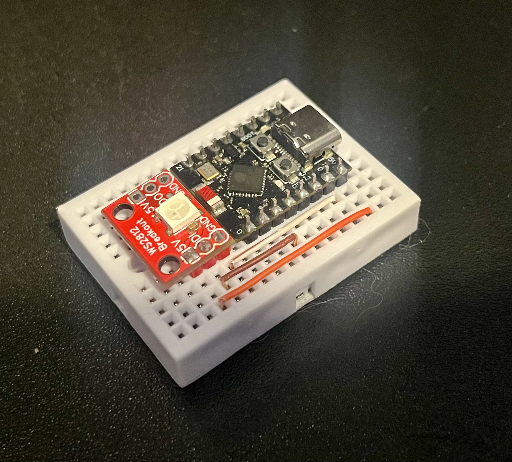

# MQTT Server ESP32-C3 SuperMini

A lightweight MQTT server implementation for the ESP32-C3 SuperMini development board, featuring WiFi connectivity, RGB LED status indicators, and comprehensive logging.

## 🚀 Features

- **MQTT Server**: Built-in MQTT broker using PicoMQTT library
- **WiFi Connectivity**: Automatic WiFi connection with configurable credentials
- **Status Indicators**: RGB LED for visual feedback of system status
- **Comprehensive Logging**: Structured logging system for debugging and monitoring
- **PlatformIO Support**: Full PlatformIO integration for easy development and deployment

## 🛠️ Hardware Requirements

- **ESP32-C3 SuperMini** (Lolin C3 Mini) development board
- **USB-C cable** for programming and power
- **WiFi network** for connectivity
- **WS2812B LED strip** for status indicators

##  Prototype



## 📋 Prerequisites

- [PlatformIO Core](https://platformio.org/install/core) or [PlatformIO IDE](https://platformio.org/install/ide)
- Python 3.6+ (for PlatformIO)
- Git

## ⚙️ Configuration

### LED Configuration

- **Brightness**: Adjustable LED brightness via `LED_BRIGHTNESS`.
- **Status Colors**:
  - **Red**: Error or connection issues
  - **Green**: Successful connection
  - **Off**: System idle

### WiFi Configuration

- **SSID**: Your WiFi network name via `WIFI_SSID`.
- **Password**: Your WiFi network password via `WIFI_PASSWORD`.
- **Hostname**: Device hostname on the network via `WIFI_HOSTNAME`.
- **Max Retry Time**: Maximum time in milliseconds to retry connection to WiFi via `WIFI_MAX_RETRY_TIME_MS`.

### Serial Configuration

- **Baud Rate**: Configurable serial communication speed via `DEFAULT_BAUD_RATE`.

## 🔧 Installation & Setup

### 1. Clone the Repository

```bash
git clone https://github.com/JMTamayo/mqtt-server-esp32c3-supermini
cd mqtt-server-esp32c3-supermini
```

### 2. Build and Upload

Using PlatformIO IDE:
1. Open the project in PlatformIO IDE
2. Click the "Build" button (✓)
3. Click the "Upload" button (→)
4. Use the "Serial Monitor" to view output

## 📡 MQTT Server

The built-in MQTT broker allows clients to:
- Connect and publish messages
- Subscribe to topics
- Receive real-time updates

### Default MQTT Settings

- **Port**: Standard MQTT port (1883)
- **Protocol**: MQTT 3.1.1
- **Authentication**: None (open broker)

## 🔍 Monitoring & Debugging

### Serial Monitor

Connect to the device via USB and monitor serial output.

### Logging

The system provides structured logging with different levels:
- **Info**: General system information
- **Error**: Error conditions and failures
- **Debug**: Detailed debugging information

## 📁 Project Structure

```
mqtt-server-esp32c3-supermini/
├── src/
│   ├── config/           # Configuration management
│   │   ├── config/       # System configuration
│   │   └── logging/      # Logging system
│   ├── peripherals/      # Hardware peripherals
│   │   └── leds/        # RGB LED control
│   ├── services/         # System services
│   │   └── wifi/        # WiFi connectivity
│   └── main.cpp         # Main application
├── platformio.ini       # PlatformIO configuration
└── README.md           # This file
```

## 📚 Dependencies

- **FastLED**: RGB LED control library
- **PicoMQTT**: Lightweight MQTT broker implementation
- **Arduino Framework**: ESP32 development framework

## 🚨 Troubleshooting

### Common Issues

1. **WiFi Connection Failed**
   - Verify SSID and password in configuration
   - Check WiFi network availability
   - Ensure proper power supply

2. **Upload Failed**
   - Check USB connection
   - Verify board selection in platformio.ini
   - Try pressing the BOOT button during upload

3. **MQTT Server Not Responding**
   - Verify WiFi connection status
   - Check serial monitor for error messages
   - Ensure firewall allows MQTT traffic

### LED Status Guide

- **Solid Red**: WiFi connection failed or MQTT server not running
- **Solid Green**: WiFi connected and MQTT server running
- **Off**: System initializing

## 🤝 Contributing

1. Fork the repository
2. Create a feature branch (`git checkout -b feature/amazing-feature`)
3. Commit your changes (`git commit -m 'Add amazing feature'`)
4. Push to the branch (`git push origin feature/amazing-feature`)
5. Open a Pull Request

## 📄 License

This project is licensed under the terms specified in the [LICENSE](LICENSE) file.

## 🙏 Acknowledgments

- [PlatformIO](https://platformio.org/) for the excellent development platform
- [PicoMQTT](https://github.com/mlesniew/PicoMQTT) for the lightweight MQTT implementation
- [FastLED](https://fastled.io/) for the RGB LED control library

## 📞 Support

For issues and questions:
1. Check the troubleshooting section above
2. Review the serial monitor output
3. Open an issue on the project repository

---

**Note**: This is a development project. For production use, consider implementing additional security measures such as MQTT authentication and TLS encryption.